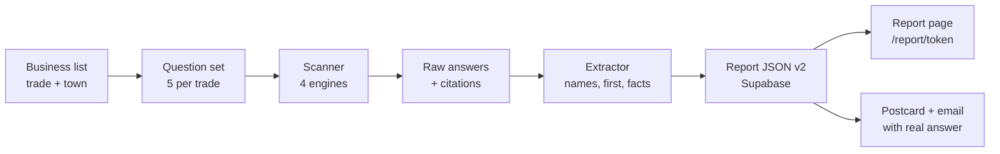

# AI Found Score Build Plan

Sep 24, 2026 · @B

## What we're building

A pipeline that produces the [Mega Wash & Dry demo report](https://claude.ai/artifact/UQLqZGMkQ9oXp2h4fX66hM) automatically: one business in, a finished report page out, with no human in between. It runs 20 real AI searches, records every answer word for word, and works out who got named, who was named first, which sites the AI cited, and what it said about the owner.

It plugs into the existing repo ([BF8thRev/ai-found-score](https://github.com/BF8thRev/ai-found-score)): Cloudflare Worker for the site, Supabase for data, Stripe payment links. The one new piece is a scanner job that writes finished report rows. The site only reads and displays them.



The scanner never writes copy for the owner that it can't trace to a stored answer or a listing it read.

## The scan pipeline

Four engines, each reached through an official or commercial API, at about $0.40 per business for 40 answers (5 questions, 4 engines, 2 runs each). 100 businesses cost about $40, which fits the sub-$100 MVP.

| Engine | How we collect it | Price (published) | Cost per scan (10 calls) | Notes |
| --- | --- | --- | --- | --- |
| ChatGPT | OpenAI Responses API with the `web_search` tool | $10 per 1,000 searches + tokens ([OpenAI](https://developers.openai.com/api/docs/pricing)) | \~$0.11 | API answers can differ from the ChatGPT app. Say so in the report. |
| Gemini | Gemini API with Grounding with Google Search | 5,000 free per month, then $14 per 1,000 ([Google](https://ai.google.dev/gemini-api/docs/pricing)) | $0 for the first \~500 scans a month, then \~$0.14 | Free tier covers the whole MVP. |
| Google AI Mode | DataForSEO AI Mode SERP API | $1.20 per 1,000 standard, $4 live ([DataForSEO](https://dataforseo.com/pricing/google-serp/google-ai-mode-serp-api)) | \~$0.04 | Closest to what a real customer sees. Can set a Long Island location. |
| Perplexity | Sonar API | $1 per 1M tokens plus a per-request fee by search depth ([CloudZero](https://www.cloudzero.com/blog/perplexity-api-pricing/)) | \~$0.10 (confirm the request fee) | Returns its cited URLs. |
| Extraction | One cheap model call per answer | fractions of a cent | \~$0.02 | Turns each answer into structured data (section 4). |

Dropped: **Copilot** (no public API for consumer answers) and **Claude** (least used for local searches). Add either later if the numbers justify it.

**Location.** APIs don't know where the customer stands, so every question includes the town and ZIP. For Google AI Mode, also set the DataForSEO location to the business's town.

**Runs.** Ask each question twice per engine. If the two runs disagree, the report counts both and says so. Store every raw response, even failed ones, with a timestamp.

## Question sets

Each trade gets 5 fixed questions, one per buying intent, filled with the business's town and ZIP. They stay the same for every re-scan so before-and-after results compare like for like.

| Intent | Template | Plumber example | Laundromat example (used in the demo) |
| --- | --- | --- | --- |
| Best | What's the best {trade} in {town}, {state}? | What's the best plumber in Massapequa, NY? | What's the best laundromat in North Babylon, NY? |
| Urgent / hours | {urgent phrase} near {town} {state} | I need an emergency plumber near Massapequa tonight | 24 hour laundromat near Deer Park NY |
| Specific job | Who can {common job} in {town} {state}? | Who can replace a water heater in Massapequa NY? | Who does laundry pickup and delivery in North Babylon NY? |
| Trust | {trade} with good reviews near {town}, {state} | Plumber with good reviews near Massapequa, NY | Laundromat with big washers for comforters near Deer Park, NY |
| Price | Cheapest / affordable {service} near {town} {state} | Affordable plumber near 11758 | Cheapest wash and fold near North Babylon NY |

Write the urgent phrase and the common job once per trade (plumbing, HVAC, electrical, roofing, landscaping, cleaning, auto repair, laundromat). Keep the wording plain, the way a homeowner types. No brand names in any question.

## Extraction

Each stored answer is turned into structured data by a cheap model call with a strict JSON schema, then checked by plain code. The model proposes; the code verifies against the raw text.

1. **Businesses named, in order.** The model returns each business name exactly as written plus its character position. Code rejects any name that isn't a literal substring of the answer.
2. **Is it the owner?** Match on normalized name (drop "LLC", "&", "Inc"), then confirm with phone, street address or website domain when present. Unsure matches are marked `unsure` and left out of counts.
3. **Named first.** The owner is "first" when theirs is the earliest business name in the answer text.
4. **Cited sources.** Taken straight from each API's citation data, never from the model: OpenAI URL citations, Gemini grounding metadata, Perplexity citations, DataForSEO references. Normalize to domain plus page URL.
5. **Owner listed on a cited page?** For the top cited directory pages (YellowPages, Superpages, Yelp, Angi and similar), fetch the page and search it for the owner's name and phone. Store the position if found. This is how the demo found Mega Wash & Dry missing from the YellowPages list.
6. **Facts about the owner.** Hours, phone, price, address and services the answer states about the owner, as exact quotes. Compare each to the owner's website and listings: `match`, `differs` or `not stated`.
7. **Competitor counts.** Group name variants of the same business by phone or address ("Island Laundromat" and "One Hour Laundry" share 1137 Deer Park Ave). Count per business: answers named, answers first.

## Report data model v2

The report becomes one JSON document per scan, stored in `scan_results` as jsonb. It replaces today's `aiResults` and `score` fields in `DATA_MODEL.md`. `business`, `listings`, `issues` and `locked` stay.

```jsonc
{
  "id": "k7m2qx",                      // public token
  "version": 2,
  "generatedAt": "2026-09-24T17:01:00-04:00",
  "business": { "name": "...", "trade": "laundromat", "address": "...", "town": "North Babylon", "zip": "11703", "phone": "...", "website": "..." },
  "questions": [ { "id": "q1", "intent": "best", "text": "What's the best laundromat in North Babylon, NY?" } ],
  "answers": [ {
    "id": "a1", "questionId": "q1", "engine": "perplexity", "run": 1, "askedAt": "...",
    "text": "<full answer>",
    "businessesNamed": [ { "name": "Park Avenue Laundromat", "pos": 0, "entityId": "e2" } ],
    "namedYou": false, "namedYouFirst": false,
    "citations": [ { "domain": "yellowpages.com", "url": "..." } ]
  } ],
  "entities": [ { "id": "e2", "name": "Park Avenue Laundromat", "aliases": [], "phone": null, "named": 2, "first": 1, "answerIds": ["a1","a6"] } ],
  "totals": { "answers": 10, "namedYou": 8, "firstYou": 4 },
  "headline": { "answerId": "a5", "rule": "most_others_named_not_you" },
  "sources": [ { "domain": "yellowpages.com", "url": "...", "citedIn": ["a1"], "youListed": false, "youPosition": null, "topListed": "Park Avenue Laundromat" } ],
  "aiFacts": [ { "answerId": "a8", "field": "price", "aiSays": "$2.25/lb, 20 lb minimum", "sourceSays": "$2.25/lb, 20 lb minimum", "status": "match" } ],
  "listings": [ /* unchanged from v1 */ ],
  "issues": [ /* ordered, severity + title + description */ ],
  "method": { "engines": { "perplexity": { "api": "sonar", "loggedIn": false } }, "window": "5:01–5:10pm ET", "runs": 2 },
  "baseline": null,                   // previous scan's totals, for before/after
  "locked": true
}
```

**Supabase.** Add `scan_raw` (one row per API call: engine, question, request, raw response, cost) so any line in a report can be traced to the call that produced it. `scan_results.report` holds the JSON above. Keep `report_links`, `payments`, `leads` and `unsubscribes` as they are.

## Report template

The page follows the demo, top to bottom. Every section reads from the JSON; none of it is written by hand.

| # | Section | Built from | Rule |
| --- | --- | --- | --- |
| 1 | Hero: "We searched {engine} for …" | `headline` | Pick the answer that names the most other businesses and not the owner. Tie: prefer ChatGPT, then Google AI Mode. If every answer names the owner, lead with the best one instead. |
| 2 | The short version: 3 tiles | `totals`, lost intents | Named X of N · first X of N · the intents they lost. One sentence on where they win and who takes their place. |
| 3 | Who AI names | `entities` | Only businesses named in 2+ answers. Owner always shown. Dark bar = first. |
| 4 | Every search grid | `answers` | Question × engine. ✓, ★ for first, ✗. Each cell opens its answer. |
| 5 | Why they got named instead | `sources` | Only sources cited in answers the owner lost. Show the owner's listing status and who's on top. |
| 6 | What AI says about you | `aiFacts` | Exact quotes. `differs` first, then `match`. |
| 7 | Your listings | `listings` | Unchanged from today, now framed as a possible reason. |
| 8 | What to fix | `issues` | Titles free, steps locked until paid. |
| 9 | Offer | `sources`, `issues` | Names the specific sites the fix covers. |
| 10 | Every answer | `answers` | Full text, collapsed. Cited URLs under each. |
| 11 | How we searched | `method` | Engines, logged in or not, time window, runs. |

**Edge states.**

- **0 of N:** lead with it. No softening line.
- **Named in every answer:** "You're in good shape." Offer only Full Year monitoring.
- **Nobody named twice:** "AI gave general advice without naming anyone in X of N answers." Hide section 3.
- **No listing mismatches and no missing sources:** hide the paywall, offer Full Year.
- **An engine failed:** drop its column and say which engine didn't respond. Never fill the gap.

## Guardrails enforced in code

The three business rules (no promises, every number from a scan, competitors only with proof) become checks that block a report from publishing.

- **Every number traces to data.** Totals are recomputed from `answers` at render time; a mismatch with stored totals blocks publish.
- **Every competitor name has proof.** A name shows only if it appears as a literal substring in at least 2 stored answers, with `answerIds` attached.
- **Every quote is exact.** Quotes are sliced from `answers.text` by position, never retyped by a model.
- **No invented claims.** Copy templates are fixed strings with slots. Words like "disconnected", "minutes", "guarantee placement", "more customers" and "rank" are banned; a lint step fails the build if they appear in a report.
- **No invented listing facts.** A listing field shows only if it was read from that page; empty fields are left out.
- **Method always shown.** Section 11 can't be turned off.
- **Sample reports use fictional names only.** Real business names appear only in reports built from real scans.

## Homepage copy

Ready to paste into `public/index.html`, replacing the matching sections. The stats block and "What you can count on" stay as they are.

**Eyebrow:** Free AI report for local service businesses

**Headline:** Customers ask AI who to call. Is it you?

**Subhead:** We ask ChatGPT, Gemini, Google AI and Perplexity the questions your customers ask, 20 times in all. You see every answer, word for word: who got named, who got named first, and which websites the AI trusted.

**Buttons:** Get my free report · See a real report

**Chips:** No email · No sales call · Every answer quoted · Ready in about a day

**Section: What the report shows**

- **What AI said when we asked.** The exact search and the exact answer, so you can type it yourself and check.
- **Who it named instead.** Every business that came up, how often, and how often it came first.
- **Why they got named.** The websites the AI cited, and whether you're on them.
- **What AI says about you.** Your hours, prices and phone as the AI states them, checked against your listings.

**Section: How it works**

1. **Tell us your business.** Name, town, and an email for the link. Thirty seconds.
2. **We run 20 searches.** Four AI assistants, five customer questions, public data only.
3. **Read it on your phone.** What AI said, who it named, and what to fix first.

**Pricing header:** The report is free. What you do next is up to you.

| Plan | Price | Copy |
| --- | --- | --- |
| Fix steps | $29 one-time | Every fix, step by step, with copy-paste text for your Google profile. If we can't show you 3 things you can fix, you get your money back. |
| Fix it and re-check (Recommended) | $59 one-time | We fix your listings and get you onto the websites AI cited in your answers. Thirty days later we run the same 20 searches and show you both results. We can't promise what AI will say. You'll be listed on every site we name, or you get your money back. |
| Full Year | $69 one-time | Fix it and re-check, plus the same 20 searches every month for a year. We email you when a competitor starts getting named over you. |

**Under pricing:** Bigger job? Duplicate listings, old addresses, or missing from a dozen directories: full listing build is $199, one-time.

**New FAQs**

- **How do you ask the AI?** Through each assistant's official service, with web search on. We list the date, time and engines in your report.
- **Why might I see something different?** AI answers change day to day and person to person. That's why we ask 20 times and show every answer.
- **Will this get me recommended?** No one can promise that, us included. We fix what's in your control, then show you exactly what changed.
- **Why no email or call to see my report?** Because you should be able to see what AI says about your business without being sold to first.

**Footer line:** match the registered DBA exactly (today it reads "Fields Holding d/b/a GetAiFound Score").

## Outreach copy

Both are filled from the report's `headline` answer. If the owner was named in every answer, send nothing: there's no honest hook.

**Postcard (front)**

> We asked {engine}: "{question}" It named {name 1}, {name 2} and {name 3}. It didn't name {business}.

**Postcard (back)**

> We ran 20 searches like this for {town} {trade}s. You came up in {X}. See every answer, free: aifoundscore.com/r/{code} No email. No sales call. — AI Found Score, Plainview, NY

**Cold email**

> **Subject:** {engine} named {N} {trade}s in {town}. Not {business}.
>
> Hi {first name or "there"},
>
> We searched {engine} for "{question}" on {date}. It named {name 1}, {name 2} and {name 3}. It didn't name {business}.
>
> We ran 20 searches like this across four AI assistants. You came up in {X}. Every answer is in your free report, word for word: {link}
>
> No login, no call. If you'd rather not hear from us, reply "stop".
>
> {sender}, AI Found Score · 120 Terminal Drive, Plainview, NY 11803

Compared with Birdeye's follow-up ("Not low. Not partial. Zero."), this one gives proof the owner can check in 10 seconds and asks for nothing.

## Build order, gates and risks

Six steps, each shippable on its own. Steps 1–3 are enough to scan the first 100 businesses.

| Step | What ships | Done when |
| --- | --- | --- |
| 1. Scanner | `scanner/` job: questions → 4 engine calls → `scan_raw` rows | 1 business scanned end to end for under $0.50, every call stored |
| 2. Extractor | Names, first, citations, facts, entity grouping → report JSON v2 | Rerunning on the Mega Wash & Dry answers reproduces the demo's counts (8 of 10, 4 first) |
| 3. Report page | `report.js` v2 template, sections 1–11, edge states, guardrail lint | Real report renders on a phone; lint blocks a planted banned word |
| 4. Site copy | Homepage from the Homepage copy section; sample report swapped for a fictional v2 sample | No real brand names in the sample |
| 5. Outreach | Postcard and email filled from `headline`; `unsubscribes` checked before every send | 300 emails sent across `email_a` / `email_b` |
| 6. Fix and re-check | $59 flow: directory submissions, 30-day re-scan, before/after view from `baseline` | Five friendly businesses re-scanned |

**MVP gates (from your plan):** at least 60% of scanned businesses unnamed in most answers, 3% replies and 2 payments on 300 emails. Add one: 3 of the 5 friendly businesses listed on every cited site within 30 days.

**Risks**

- API answers differ from the apps people use. *Mitigation:* Google AI Mode through DataForSEO is closest to real; show the method line. Confidence the counts hold up if an owner checks: 65%.
- Answers vary run to run. *Mitigation:* 2 runs, show both. Confidence the headline answer reproduces on the owner's phone: 55%.
- Getting onto cited sites may not change answers within 30 days. *Mitigation:* guarantee only the listing, show the re-scan honestly. Confidence of a visible improvement for most $59 buyers: 45%.
- Strong businesses (like Mega Wash & Dry, 8 of 10) have a weaker hook. *Mitigation:* scan first, send only when the headline answer names 2+ others and not the owner.

## Taking this into Claude Code

Open the `ai-found-score` repo in Claude Code (desktop app or terminal) and add this plan as `docs/BUILD_PLAN.md`. Then give it one step at a time, for example:

> Read docs/BUILD\_PLAN.md and DATA\_MODEL.md. Build step 1 (the scanner) as described: a Node script in scanner/ that takes a business, fills the 5 question templates, calls the four engines, and writes every raw response to a new scan\_raw table. Keys come from env vars. Stop after one successful test scan and show me the stored rows and the cost.

Keys you'll need first: OpenAI, Gemini, Perplexity, DataForSEO, plus the existing Supabase service key.
